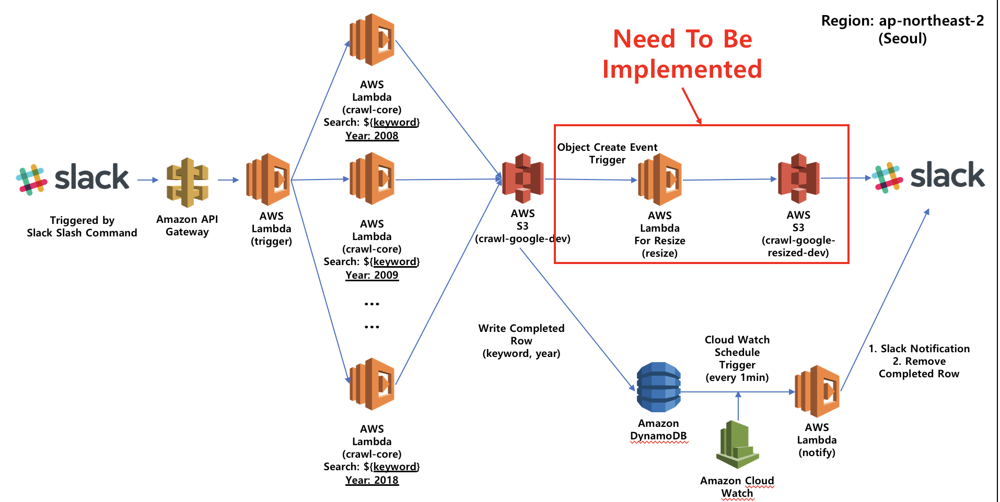
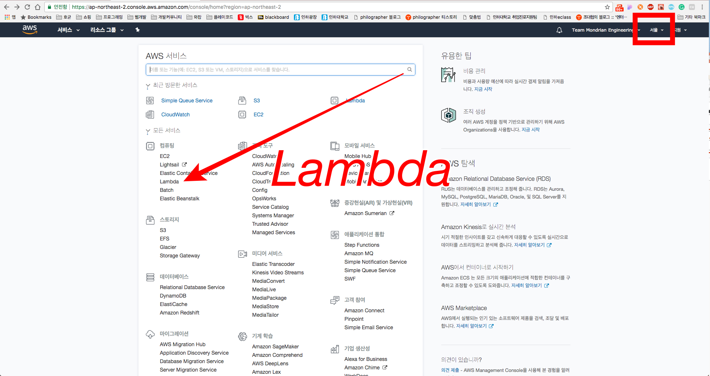
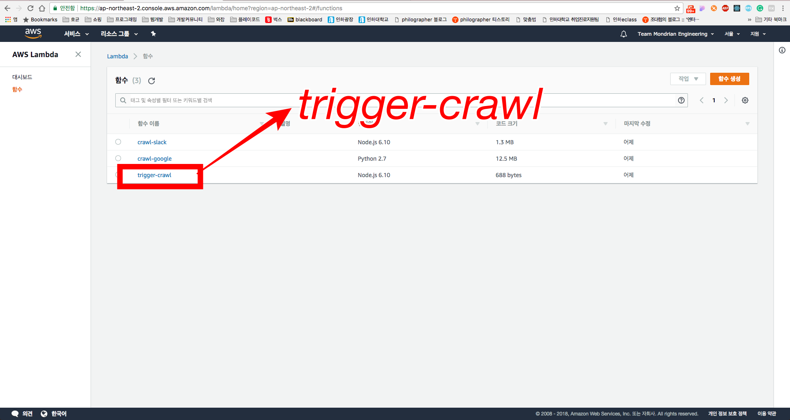
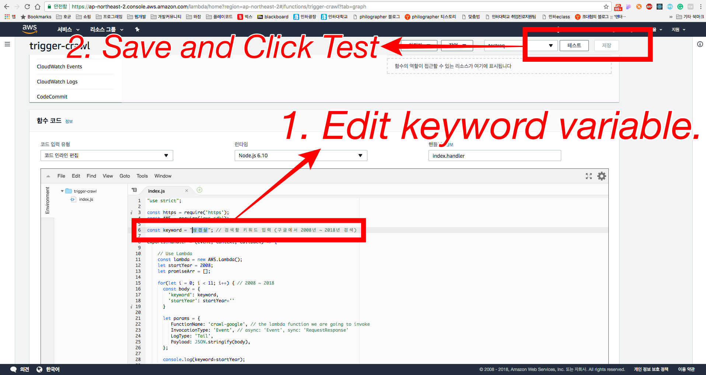
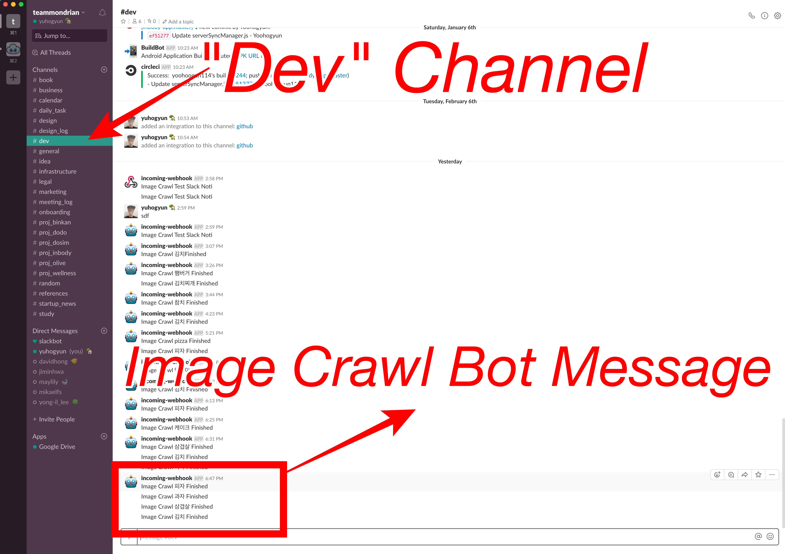
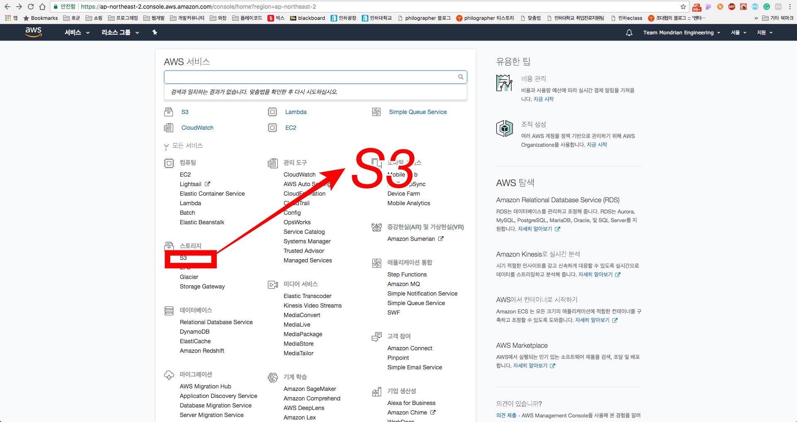
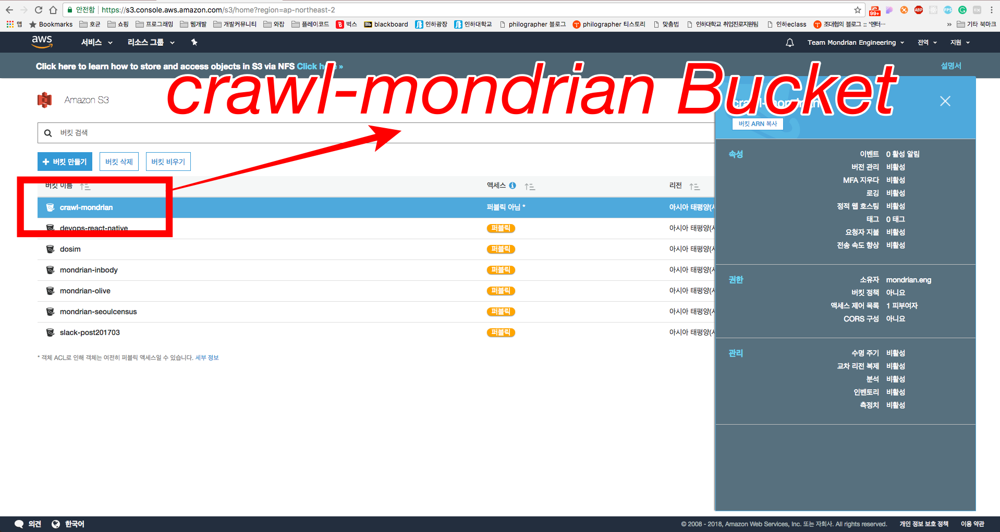
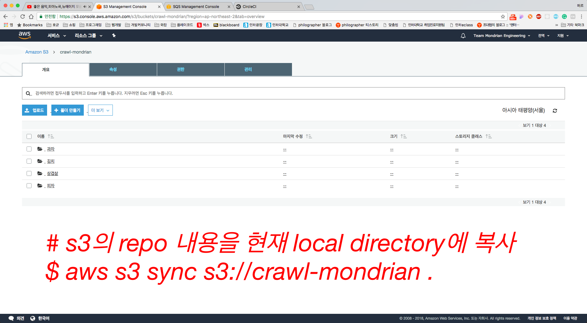
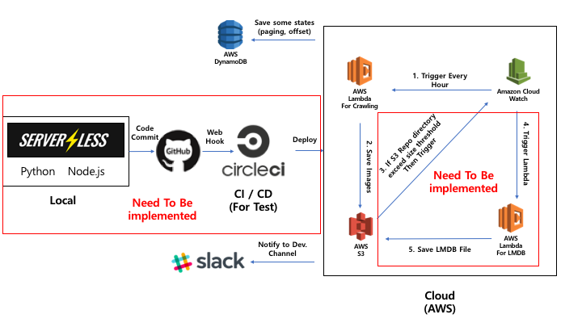

## Implemented Architecture Overview
Our Team Need to Image Crawling service for image learning.

So I Designed crawling micro service architecture like this.
1. user manually run Lambda Function named `trigger-crawl`
2. `trigger-crawl` function trigger  multiple `crawl-google` function `crawl-google` called multiple times with different arguments
3. `crawl-google` function crawl images from google, and then upload images to `crawl-mondrian` s3 bucket
4. If `crawl-google` function ended then send message to `crawl-queue` SQS. 
5. Every 1 minute, Cloud watch event rule automatically triggered by reservation. 
6. The Cloud watch trigger to run `crawl-slack` lambda function.
7. `crawl-slack` lambda function check if `crawl-queue`  has same 11 keyword (2008 ~ 2018, 11years).
8. If `crawl-queue`  has same 11 keyword then `crawl-slack` remove keyword from `crawl-queue` then web hook to send slack message.


## How To Use
1. Click **Lambda** on AWS Console (You should have selected ap-northeast-2 region -> 서울)


1. Click **trigger-crawl** in Lambda Dashboard


1. First. Please Edit `keyword` variable what you want to search.
Second. Click **Save** Button
Third. Click **Test** Button


1. After a while, Slack Message would be sent to dev channel


1. Then, Click **S3** on AWS Console


1. Then, Click **crawl-mondrian** Bucket 


1. You can see crawled image.


1. You can sync Bucket with local directory
```bash
## ref1.  https://docs.aws.amazon.com/cli/latest/reference/s3/sync.html
## ref2. https://docs.aws.amazon.com/ko_kr/cli/latest/userguide/installing.html

# AWS Cli Install
$ pip install awscli --upgrade --user

# s3의 Bucket을 현재 local directory에 다운로드
$ aws s3 sync s3://crawl-mondrian .

# 현재 local directory의 내용을 Bucket으로 업로드 (없는 내용은 지움, local에서 삭제한 이미지는 Bucket에서도 삭제)
$ aws s3 sync . s3://crawl-mondrian --delete
```

## Grand Goal Architecture


## Source reference
- [Serverless - The Serverless Application Framework powered by AWS Lambda, API Gateway, and more](https://serverless.com/)
- [Continuous Integration and Delivery - CircleCI](https://circleci.com/)
- [Amazon Web Services](https://aws.amazon.com/ko/)
- [Webhooks | GitHub Developer Guide](https://developer.github.com/webhooks/)
- [Incoming Webhooks | Slack](https://api.slack.com/incoming-webhooks)
