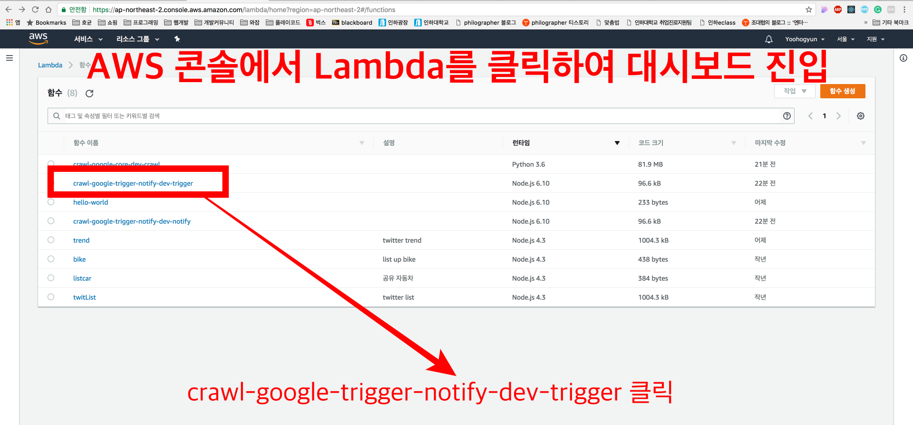
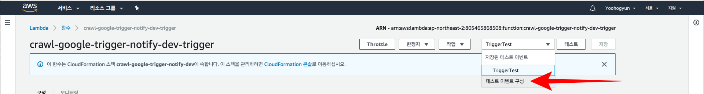
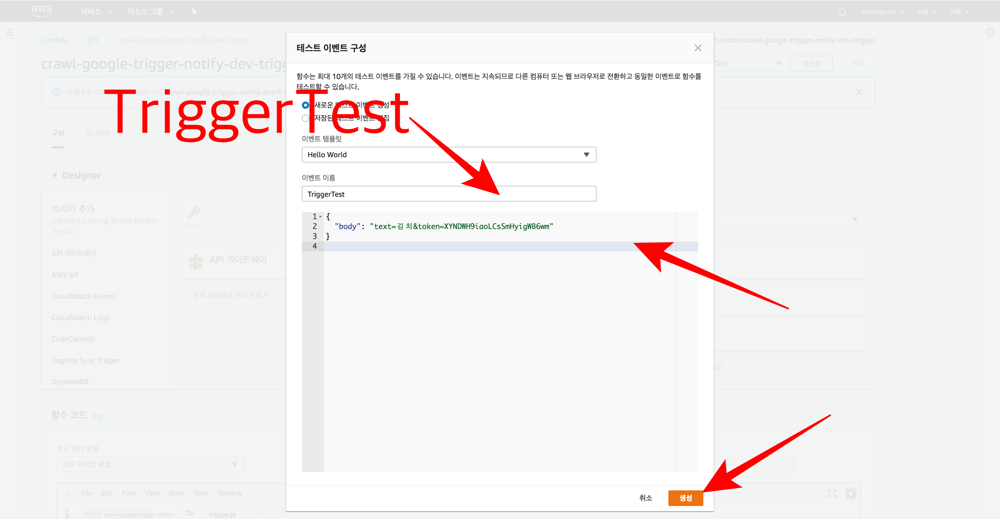
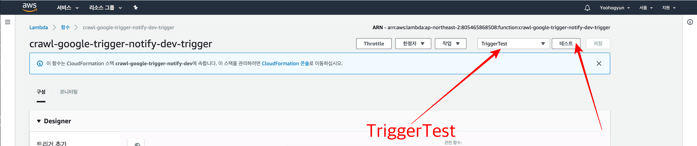

## Implemented Architecture Overview
Our Team Need to Image Crawling service for image learning.

So I Designed crawling micro service architecture like this
1. user manually run Lambda Function named `trigger`
2. `trigger` function trigger multiple `crawl-core` with different arguments(2008 ~ 2018, 11years with same keyword)
3. `crawl-core` function crawl images from google, and then upload images to `crawl-google-dev` s3 bucket
4. If `crawl-core` function ended then PutItem into DynamoDB named `crawl-google-dev`
5. Every 1 minute, Cloud watch event rule automatically triggered by reservation
6. The Cloud watch trigger to run `crawl-slack` lambda function
7. `notify` lambda function check if `crawl-google-dev` DynamoDB has same 11 keyword (2008 ~ 2018, 11years)
8. If `crawl-google-dev` DynamoDB has 11 same keyword(2008 ~ 2018, 11years) then `notify` lambda function remove keyword from `crawl-google-dev` DynamoDB and then inform to slack


## How To Use
```bash
# Clone Github Repo
$ git clone https://github.com/philographer/crawl-google.git

# Install Serverless Framework
$ npm install -g serverless

# !!!!!!!!!!!!!!!!!Watch the video: https://www.youtube.com/watch?v=HSd9uYj2LJA!!!!!!!!!!!!!!!!!
$ serverless config credentials --provider aws --key [YOUR-ACCESS-KEY] --secret [YOUR-SECRET-KEY]

# Change Working Directory
$ cd crawl-google

# Install dependency
$ npm run dependency

# Deploy your Code
$ npm run deploy
```




```json
// Test Event name is `TriggerTest` and Insert Text like below. And Click `생성`
{
"body": "text=김치&token=XYNDWH9iaoLCsSmHyigWB6wm"
}
```


- **Then Select `TriggerTest` And Click `테스트`**


- **Wait a 5minutes Then, Click `S3` on AWS Console**


- **Then, Click `crawl-google-dev` Bucket**


- **You can see crawled image.**


- **You can sync Bucket with local directory**
```bash
## ref1.  https://docs.aws.amazon.com/cli/latest/reference/s3/sync.html
## ref2. https://docs.aws.amazon.com/ko_kr/cli/latest/userguide/installing.html

# AWS Cli Install
$ pip install awscli --upgrade --user

# s3의 Bucket을 현재 local directory에 다운로드
$ aws s3 sync s3://crawl-google-dev .

# 현재 local directory의 내용을 Bucket으로 업로드 (없는 내용은 지움, local에서 삭제한 이미지는 Bucket에서도 삭제)
$ aws s3 sync . s3://crawl-google-dev --delete
```

## Grand Goal Architecture


## Source reference
- [Serverless - The Serverless Application Framework powered by AWS Lambda, API Gateway, and more](https://serverless.com/)
- [Continuous Integration and Delivery - CircleCI](https://circleci.com/)
- [Amazon Web Services](https://aws.amazon.com/ko/)
- [Webhooks | GitHub Developer Guide](https://developer.github.com/webhooks/)
- [Incoming Webhooks | Slack](https://api.slack.com/incoming-webhooks)
